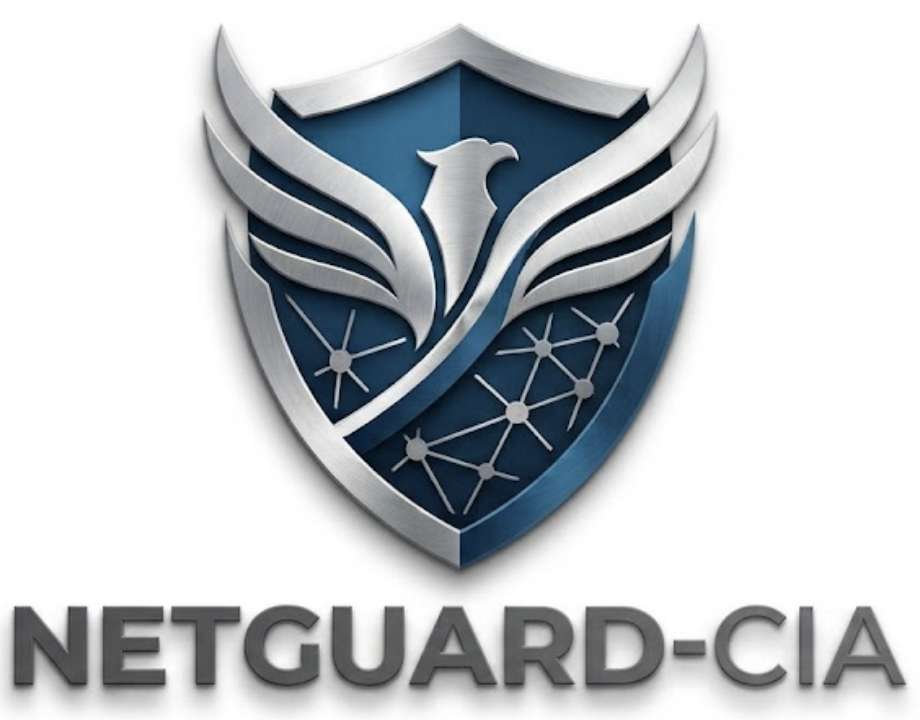

<p align="center">
  
</p>

# NetGuard-CIA — Network Change-Impact Analysis

**Ask your network "what if?" in plain English. Get a Go / No-Go verdict backed
by deterministic analysis — not LLM guesswork.**

NetGuard-CIA is a chat application for network engineers. Upload your device
configurations (Cisco IOS / Juniper Junos), then ask two kinds of question:

**Change scenarios** — "what if I…" — get a Go/No-Go **verdict**:

> *"What breaks if I shut the link between as1border1 and as2border1?"*
> *"Now also fail the backup link — can AS1 still reach 2.128.0.0/16?"*
> *"Is this ACL change safe?"*

**Read-only questions** about the network as it is — get a direct **answer**:

> *"Can host 10.10.10.1 reach the DNS server on UDP 53 through acl_in?"*
> *"Which device owns 2.1.3.2?"  ·  "List the devices and their vendors."*
> *"Why is the BGP session on as1border1 down?"  ·  "Are there any config problems?"*

The app **classifies each turn automatically**: a change scenario returns a
structured **VERDICT** (GO / GO-WITH-CONDITIONS / NO-GO / INSUFFICIENT-DATA) with
verified facts, the checks run, a rollback plan, and before/after topology
diagrams; a read-only question returns a direct **ANSWER** with its evidence — no
Go/No-Go, because nothing is being approved.

Under the hood it drives 35 deterministic Batfish analyses spanning reachability
and path analysis, routing and BGP/OSPF, ACL/firewall and route-policy behavior,
failure simulation and change diffing, engine health assertions, and network
inventory (device properties, IP ownership, peer config).

## The one principle

**[Batfish](https://www.batfish.org/) computes every network fact. The LLM only
translates your intent into analysis queries and writes up the verdict.**
If the answer asserts a routing or reachability fact that didn't come from the
analysis engine, that's a bug. Every reasoning step in a verdict is tagged with
its provenance: `[verified]` (computed by the engine), `[vendor-doc]` (a
documented Cisco/Junos behavior), or `[judgment]` (the model weighing
significance) — and confidence is capped by the weakest link in that chain.

## What it looks like

- **Verdict / answer banner** — color-coded GO ✅ / conditions ⚠️ / NO-GO ⛔ for
  change scenarios; OK / Attention for read-only questions
- **At a glance** — for a change: confidence, impacted services, packet flow,
  rollback; for a query: the answer, status, and evidence
- **Network checks performed** — every analysis run, its target, and its result
- **Findings & full response** — the evidence base and the tagged reasoning
- **Topology diagrams** — your network on upload; before/after side-by-side
  when a change is simulated (lost links dashed red, failed devices red)
- **Session state** — a running timeline of simulated failures and config
  changes; scenarios stack ("now also fail X" builds on the previous step)

## Architecture

```
┌───────────────────────────────────────────┐
│  Streamlit chat UI  (app/)                │  upload configs, ask scenarios
└───────────────┬───────────────────────────┘
                │  LLM translator + verifier + synthesizer
                │  (Commotion or Ollama — swap via NETGUARD_LLM_PROVIDER)
┌───────────────▼───────────────────────────┐
│  Batfish MCP server (docker, port 3009)   │  snapshot mgmt + analysis tools
│  + direct pybatfish access (port 9996)    │  sessions, diffs, forks, loops
└───────────────┬───────────────────────────┘
┌───────────────▼───────────────────────────┐
│  Batfish engine (docker)                  │  the deterministic analysis core
└───────────────────────────────────────────┘
```

The LLM runs a tool-use loop against a curated set of analysis actions:

| Check | What it computes |
|---|---|
| Failure simulation | fails nodes/interfaces as one engine fork; stacks across turns |
| Path trace | hop-by-hop forwarding with ACL decisions and disposition |
| Traffic simulation | can a described flow get through, and how is it disposed |
| Two-way reachability | catches asymmetric routing and one-way blocks |
| BGP session check | per-neighbor session establishment (as modeled) |
| Before/after comparison | exactly which flows changed disposition between states |
| Loop check | forwarding loops in a changed network |
| Route lookup | which routes were actually selected into the RIB |
| Configuration health | parse issues, undefined refs, duplicate IPs, dead peers |
| Configuration change | applies a config edit, re-validates, advances the timeline |

Config **edits** rebuild the network model; **failures** are cheap engine forks
of the current state — and the two compose, so an edit made while failures are
active keeps those failures applied.

## Quickstart

Prereqs: Docker (≈4 GB RAM free for the engine), Python 3.11+, and LLM
credentials (a Commotion AI-worker, or an [Ollama Cloud](https://ollama.com) key).

**One command** (starts Docker, waits for the engine, installs deps, launches the app):

```bash
git clone https://github.com/vinu87a/netguard-cia.git
cd netguard-cia

# create .env at the repo root with your LLM credentials (see below), then:
./run.sh
```

<details><summary>Or run each step manually</summary>

```bash
# 1) analysis stack (two containers, images pinned)
docker compose -f docker/docker-compose.yml up -d --wait

# 2) python env
python3 -m venv .venv && .venv/bin/pip install -r requirements.txt

# 3) run
.venv/bin/streamlit run app/streamlit_app.py --server.port 8501
```
</details>

Create a **`.env`** at the repo root (gitignored) with the Commotion worker
credentials:

```
NETGUARD_LLM_PROVIDER=commotion
COMMOTION_URL=https://uat-services.solutions.tatacommunications.com/gateway/aiworker/run
COMMOTION_API_KEY=your-key
COMMOTION_WORKER_ID=your-worker-id
COMMOTION_AUDIENCE_ID=RPA
COMMOTION_ROUTE_SELECTOR=aicoe_workspace
```

Open http://localhost:8501, upload configs from one of the demo scenarios,
click **Build snapshot**, and ask away.

> **Deploying to a Linux server?** See **[DEPLOY.md](DEPLOY.md)** — a full Rocky
> Linux 9 runbook (Docker CE, Python 3.11, SELinux, firewalld, systemd,
> nginx + TLS).

### Demo scenarios

`scenarios/` contains five self-contained demos built from the official
[Batfish examples](https://github.com/batfish/pybatfish) — each folder has the
configs to upload, a `QUESTIONS.txt` with questions and expected outcomes, and
a topology diagram:

| Scenario | Network | Theme |
|---|---|---|
| 1 — failure impact & chaos monkey | 13 city routers | node/link failures, stacked "now also fail X" |
| 2 — link failure with failover | classic 3-AS lab | failover verdicts, stacking, seeded defects |
| 3 — ACL & firewall rules | 2 devices | filter permit/deny with crisp expected answers |
| 4 — BGP session debugging | 3-AS lab variant | every broken-session flavor, on purpose |
| 5 — route analysis | 2 routers | small enough to verify every fact by hand |

### Configuration

| Setting | Default | Purpose |
|---|---|---|
| `NETGUARD_LLM_PROVIDER` | auto | `commotion,ollama` (primary,fallback), a single name, or unset (auto) |
| `OLLAMA_API_KEY` (.env) | — | Ollama Cloud credentials |
| `OLLAMA_BASE_URL` | `https://ollama.com/v1` | any OpenAI-compatible endpoint works |
| `NETGUARD_TRANSLATOR_MODEL` | `qwen3-coder:480b` | the tool-calling model (Ollama) |
| `NETGUARD_SYNTHESIZER_MODEL` | `gpt-oss:120b` | the verdict-writing model (Ollama) |
| `COMMOTION_URL` / `COMMOTION_API_KEY` / `COMMOTION_WORKER_ID` | — | Commotion (Tata Communications AI worker) credentials |
| `BATFISH_MCP_URL` | `http://localhost:3009/mcp/` | analysis server endpoint |
| `BATFISH_DIRECT_HOST` | `localhost` | direct engine host |

**LLM provider** — the app abstracts the LLM behind `app/llm_provider.py`, so
you can run Ollama Cloud alone, Commotion alone, or Commotion-primary with
Ollama-fallback (`NETGUARD_LLM_PROVIDER=commotion,ollama`). Commotion has no
native function-calling API, so the adapter emulates tool use via a strict
JSON protocol; if it fails mid-question the turn continues on the fallback with
the full transcript replayed. For Commotion, paste the persona in
`Misc/docs/08_commotion_worker_persona.md` into the worker's system prompt.

## Project structure

```
app/                    the Streamlit app (runtime)
  streamlit_app.py        chat UI: upload, verdict tables, topology
  orchestrator.py         translator loop, session ledger, synthesizer
  llm_provider.py         provider layer (Ollama / Commotion + fallback)
  mcp_client.py           analysis-server client
  engine_direct.py        direct engine questions (forks, sessions, diffs)
  ui_helpers.py           verdict parsing / checks table / topology icons
prompts/                LLM system prompts (loaded at runtime)
docker/                 the analysis stack (compose, pinned images, patches)
scenarios/              five ready-made demos (configs + questions)
Misc/                   design docs and reference material (not needed to run)
CLAUDE.md               project brief + build log (for AI-assisted development)
```

## Design guarantees

- **Parse gate** — no verdict is produced on a half-parsed config set.
- **Right output for the question** — a change scenario gets a Go/No-Go verdict;
  a read-only question gets a direct answer (never a spurious "GO" for a lookup).
  The classifier is deterministic — it keys on whether the turn actually mutated
  the network, not on the LLM's guess.
- **Two-zone answers** — verified findings are always visually separate from
  judgment, and every reasoning step carries a provenance tag.
- **Bad tool args never reach the engine** — a pre-flight validator plus
  arg-coercion bounce malformed analysis calls back for correction instead of
  crashing (or wedging) the engine.
- **Mandatory residual-unknowns** — config-only analysis cannot see live
  utilization, real-time session state, convergence timing, or hardware faults;
  every verdict says so.
- **Guarded edits** — a config edit that fails to parse, or that silently
  gutted a device file, is rejected and the session state does not advance.
- **Multi-vantage probing** — reachability conclusions require agreement from
  multiple probe points; a single-source break can only lower the verdict to
  "insufficient data", never to a confident NO-GO.

## Acknowledgments

- [Batfish](https://www.batfish.org/) — the open-source network analysis
  engine that computes every fact in this app.
- [pybatfish](https://github.com/batfish/pybatfish) (Apache-2.0) — the Python
  client used for direct engine questions; the demo networks in `scenarios/`
  come from its example notebooks.
- [Presidio-Federal/batfish-mcp-container](https://github.com/Presidio-Federal/batfish-mcp-container)
  (MIT) — the MCP wrapper around Batfish. `docker/patches/` carries a small
  fix (derived from that MIT-licensed code) for a snapshot-naming bug in its
  failure-impact tool, which the compose file mounts over the container.

## Disclaimer

NetGuard-CIA analyzes **configurations**, not live networks. Verdicts model
what the configs imply; they cannot see the state of running devices. Always
pair a GO with your own change-management process.
